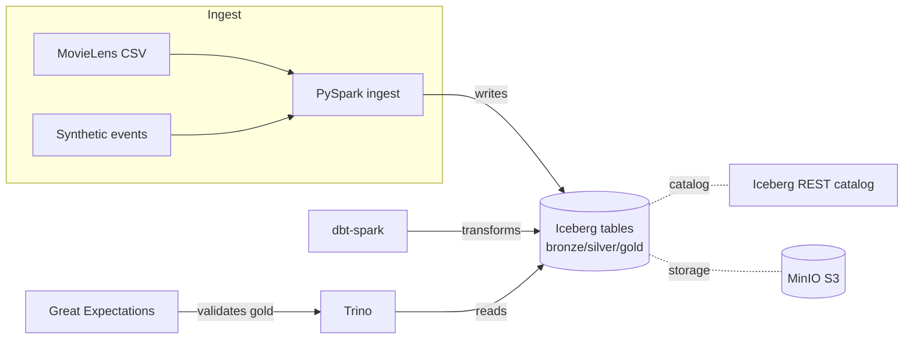

# iceberg-lakehouse-lab

[](https://github.com/jamesbruning/iceberg-lakehouse-lab/actions/workflows/ci.yml)

A local, fully-Dockerized **Apache Iceberg lakehouse**. It ingests the real MovieLens
dataset plus a synthetic playback-events stream into Iceberg, transforms it through
bronze → silver → gold with **dbt-spark**, validates it with **dbt tests + Great
Expectations**, and serves it through **Trino** — all on object storage (MinIO/S3), the
way modern data platforms (including the one Iceberg was born at, Netflix) actually run.

## Architecture



## What this demonstrates

- **Apache Iceberg** fluency: snapshots, time-travel, rollback, schema & partition
  evolution, hidden partitioning, compaction/maintenance (see [`demos/`](demos/)).
- **Lakehouse separation of concerns**: storage (MinIO), catalog (Iceberg REST), and
  compute (Spark + Trino) as independent, swappable layers.
- **Medallion modeling with dbt**: conformed dims/facts in silver, business marts in gold.
- **Data quality**: dbt tests + `dbt-expectations` across every model, plus a focused
  **Great Expectations** suite on the critical gold table.
- **Two query engines** agree on one set of tables (Spark writes, Trino reads).
- **Engineering hygiene**: Makefile orchestration, ruff lint, pytest, GitHub Actions CI.

## Quickstart

**Prerequisites:** Docker + Docker Compose, Python 3.11, `make`.

```bash
python3.11 -m venv .venv && . .venv/bin/activate && pip install -r requirements.txt
make up      # start MinIO + Iceberg REST + Spark + Trino
make seed    # download MovieLens + generate 7 days of playback events
make ingest  # load raw data into bronze Iceberg tables
make build   # dbt run: silver + gold
make test    # dbt tests + Great Expectations
make demo    # run the 5 Iceberg feature demos
make query   # open a Trino CLI against the demo catalog
```

End state: all dbt tests + GE pass, and the five demos print their before/after output.
Run `make help` to list every target.

## Repo tour

| Path | Responsibility |
|------|----------------|
| `docker-compose.yml`, `docker/` | MinIO, Iceberg REST catalog, Spark (+thrift), Trino |
| `ingestion/` | MovieLens download, synthetic event generator, bronze ingest |
| `dbt/` | dbt-spark project: silver + gold models and tests |
| `quality/` | Great Expectations suite on gold `movie_engagement` |
| `demos/` | One Iceberg capability per script (01–05) |
| `trino/` | Sample analyst queries |
| `tests/` | pytest for the generator/download + stack smoke test |
| `docs/` | Architecture diagram + the blog post |

## The Iceberg demos

| Script | Shows |
|--------|-------|
| [`demos/01_time_travel.py`](demos/01_time_travel.py) | Snapshots, `VERSION AS OF`, rollback from a bad load |
| [`demos/02_schema_evolution.py`](demos/02_schema_evolution.py) | Add a column, no rewrite, old data still reads |
| [`demos/03_hidden_partitioning.py`](demos/03_hidden_partitioning.py) | Hidden partitioning + partition evolution |
| [`demos/04_compaction_maintenance.py`](demos/04_compaction_maintenance.py) | `rewrite_data_files` compaction + snapshot expiry |
| [`demos/05_iceberg_vs_parquet.py`](demos/05_iceberg_vs_parquet.py) | What plain Parquet can't do — the core argument |

## Read more

- **Blog:** [Building an Iceberg lakehouse, and why table format matters](docs/blog/why-table-format-matters.md)
- **Architecture:** [docs/architecture.md](docs/architecture.md)
