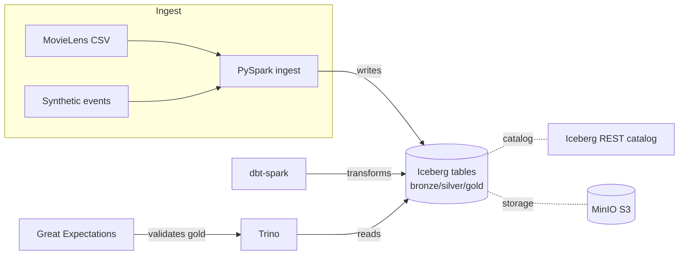

# Architecture

## Component diagram

## Components

| Component | Role |
|-----------|------|
| MinIO | S3-compatible object store (the data lake) |
| Iceberg REST catalog | Tracks table metadata / snapshots |
| Spark (PySpark) | Ingestion + dbt-spark transforms |
| Trino | Interactive SQL query engine |
| dbt-spark | Bronze→silver→gold transformations + tests |
| Great Expectations | Data-quality validation on the critical gold table |

## Data layers

- **Bronze:** raw, append-only (`movies`, `ratings`, `tags`, `links`, `playback_events`)
- **Silver:** conformed (`dim_movie`, `dim_user`, `fact_rating`, `fact_playback_event`)
- **Gold:** marts (`movie_engagement`, `daily_active_users`, `top_titles`)
